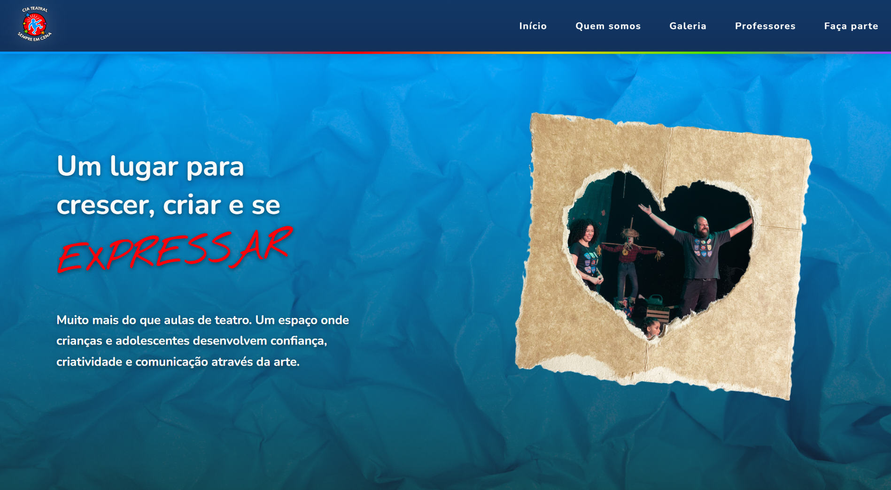
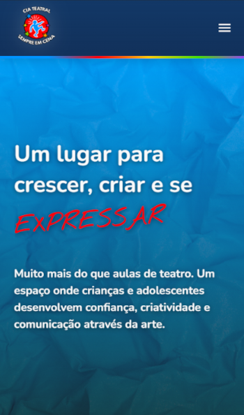

# Sempre em Cena Institutional Website

## Overview

This project is an institutional website developed for Companhia Sempre em Cena, a theater company that uses theatrical games to promote the personal and artistic development of children and teenagers.

The website was created to strengthen the company's digital presence and provide parents and students with easy access to information about its methodology, teachers, classes, schedules and activities.

This is my first real client project, developed to help the company build a more professional online presence and better showcase its work.

## Screenshots

### Desktop

### Mobile

## Features

* Responsive design using a mobile-first approach
* Component-based architecture with React
* Institutional website structure
* Information about the company, teachers, classes and activities
* Gallery structure for previous showcases
* Reusable components for easier maintenance

## Technologies

* React
* Vite
* JavaScript (ES6+)
* CSS3
* Font Awesome

## Live Demo

Vercel

https://theater-showcase-project.vercel.app/

## Status

Under development
